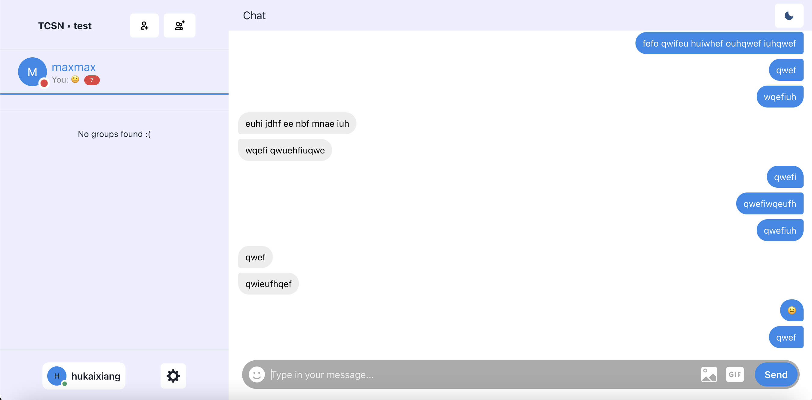
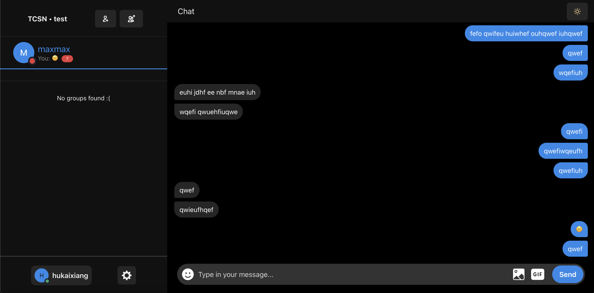
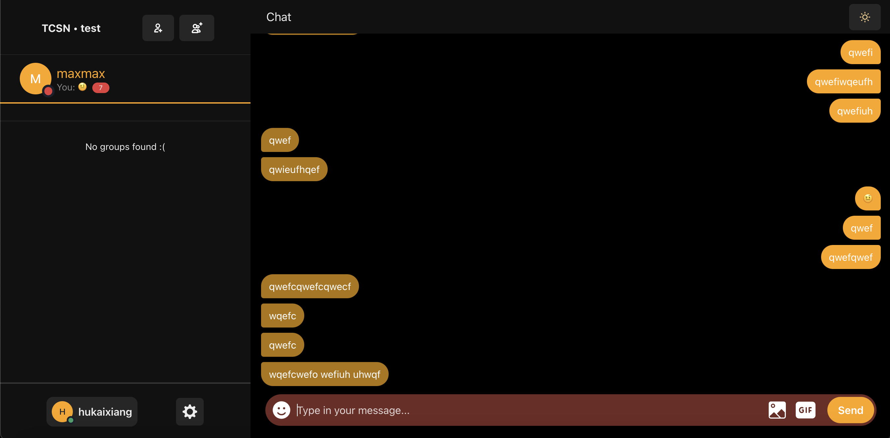
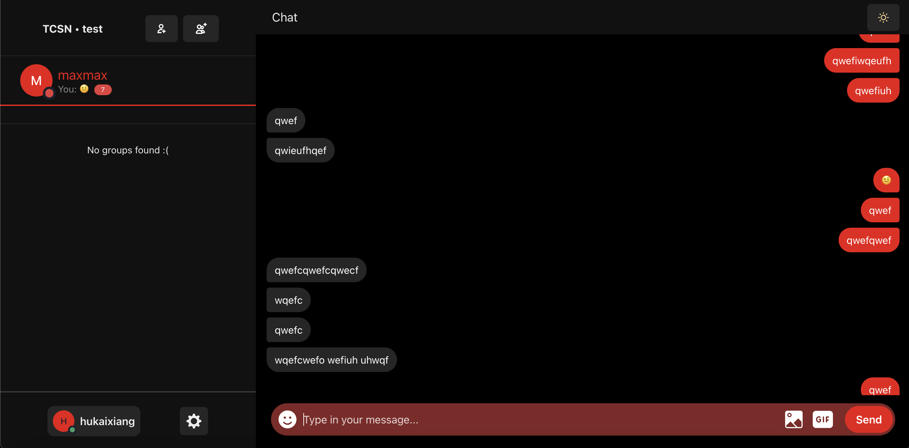
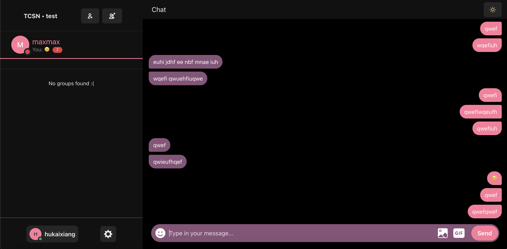

<div align=center>

<picture>
  
</picture>

聊天網站實作 react-redis-chat

</div>

---

- 前端：ReactJS + Sass
- 後端：Node.js, ExpressJS, Socket.io, Redis, PostgreSQL
- 其它：Chakra UI (ui 套件), Framer Motion (動畫), Formik (表單驗證)

一個用 ReactJS 打造的聊天室網站，並且使用 redis 快取讀取訊息。

## 功能

- 創建帳號、個人檔案 (頭像、自介等)
- 加好友、創建群組
- 即時訊息、上線狀態
- Login session (可避免每次重新登入)
- 傳送圖片、表情符號、圖片嵌入
- 聊天室個人化選擇 (顏色)

## 快速開始

### 1) 安裝依賴 & 啟動前端開發環境
```
npm install
npm run start
```

### 2) 安裝依賴 & 啟動後端開發環境
```
cd server
npm install
npm run start
```

## 實作細節

### 帳號管理

- 用戶帳號資料存儲於 PostgreSQL，包括：
  - 用戶 ID
  - 名稱
  - 密碼 hash
  - 頭像
  - 個人簡介
- 登錄時，使用 `express-session` + Redis 儲存 session，使用戶可在一週內免重新登入。

### 訊息傳輸

- 訊息透過 `socket.io` 即時廣播給其他用戶。
- 高讀取率資料存入 Redis，像是訊息、登入 session 等。

### 群組與好友

- 群組及好友關係數據存儲於 Redis，提高存取效能。
- PostgreSQL 主要用於存儲帳號資料。

### 前端開發

- 使用 Chakra UI 套件。
- 使用 Framer Motion 動畫套件，例如：
  - 載入畫面的 Logo 動畫
  - 新訊息彈跳動畫

### 其他

- 使用 Docker 容器化。

## 截圖區 


<table>
  <tr>
    <td></td>
    <td></td>
  </tr>
  <tr>
    <td></td>
    <td></td>
  </tr>
</table>
